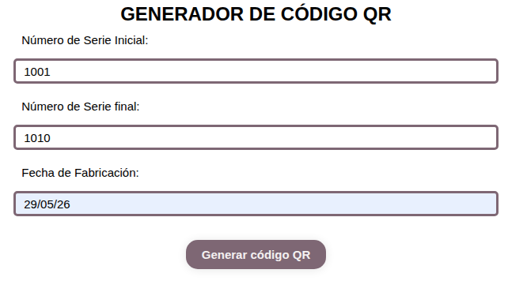
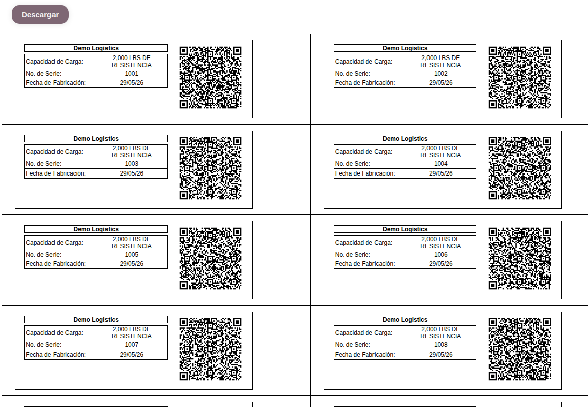
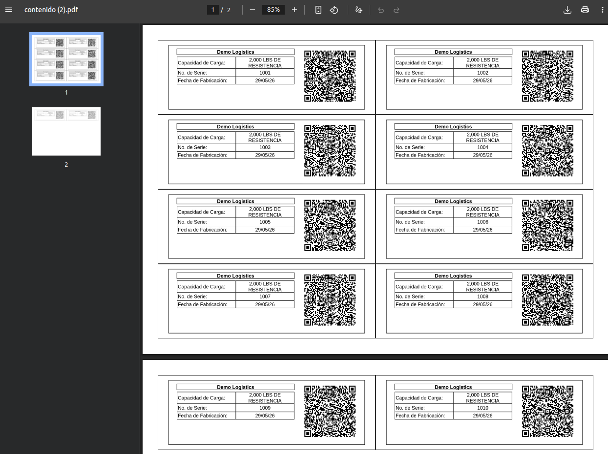

# Industrial Label Generation System

A web application developed to automate the large-scale generation of labels used in industrial cargo straps.

The system allows users to create customized labels with client logos, load capacity specifications, and sequential serial numbers, ready to be exported as PDF files and printed.

---

## 🚀 Overview

This project originated from a real business need within a small company that manufactures cargo straps.

Previously, labels were created manually using Paint. When a customer requested hundreds of labels with unique serial numbers, the process became time-consuming, repetitive, and prone to errors.

To address this challenge, a tool was developed to automate label generation and streamline the preparation of high-volume orders.

---

## 🎯 Problem

Original workflow:

1. Create a label manually.
2. Change the serial number.
3. Save the file.
4. Repeat the process for every label.

While this approach worked for small orders, it became inefficient when hundreds of unique labels needed to be produced.

---

## 💡 Solution

The application allows users to:

- Enter customer information.
- Upload custom client logos.
- Configure load capacity specifications.
- Define serial number ranges.
- Generate labels automatically.
- Export labels as PDF files for printing.

---

## 📸 Application Workflow

### Input Form

The user enters the serial number range and production information required to generate a batch of labels.

### Generated Labels

The system automatically creates multiple labels with unique serial numbers and QR codes.

### PDF Export

Generated labels can be exported as PDF files ready for printing and production.

---

## ⚙️ Production Requirements

The label layout was designed according to real manufacturing constraints.

- Label dimensions were defined in centimeters to match production specifications.
- A dedicated stitching margin was intentionally included to allow labels to be sewn onto industrial cargo straps.
- Each label contains a unique serial number for identification and traceability.
- The generated PDF is optimized for printing and batch production.

---

## ✨ Features

- Bulk label generation.
- Automatic serial number sequencing.
- Customer-specific customization.
- QR code generation.
- PDF export.
- Web-based interface accessible from multiple devices.
- Reduced manual and repetitive work.

---

## 🛠 Technologies

- HTML5
- CSS3
- JavaScript
- Python (initial prototype)
- PDF Generation
- Git & GitHub

---

## 🔄 Alternative Evaluation

During development, two implementation approaches were explored.

### Desktop Application

Developed as an initial proof of concept using Python.

### Web Application

Developed using web technologies to improve accessibility, maintenance, and usability across different devices.

After evaluating both alternatives with the client, the web application was selected as the final solution.

---

## 📚 Key Learnings

This project helped strengthen skills in:

- Requirements gathering.
- Client communication.
- Business process analysis.
- Automation of repetitive tasks.
- Evaluation of technical alternatives.
- User-centered solution development.

---

## 🚧 Project Status

Functional version completed and validated for the identified workflow.

Future improvements:

- Template management.
- Generation history.
- Support for additional export formats.
- Customer management features.

---

## 👩‍💻 Author

Angela Jasso

Software Developer

Interested in web development, systems thinking, process automation, and building technology solutions for real-world problems.
